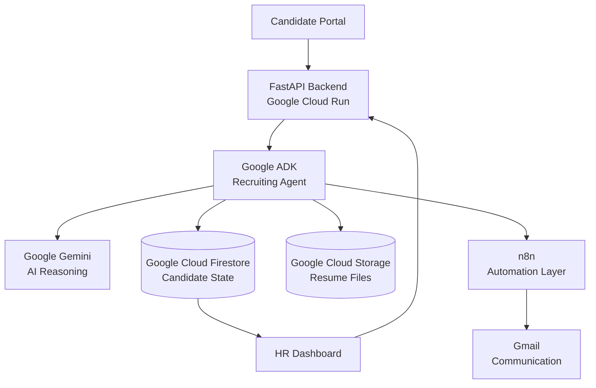
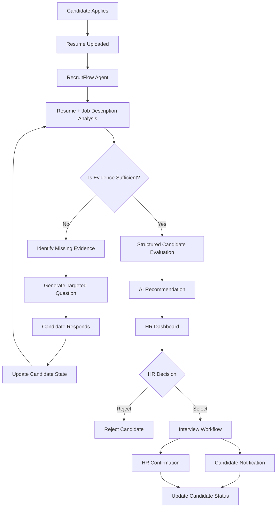
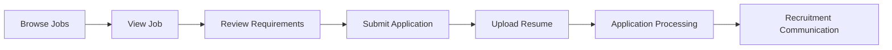

# RecruitFlow Agent

<p align="center">
  <strong>AI-Powered Recruiting Operations Platform</strong>
</p>

<p align="center">
  Automate the work. Preserve the judgment.
</p>

<p align="center">
  
  
  
  
  
  
</p>

---

## Overview

RecruitFlow Agent is an AI-powered recruiting operations platform designed to streamline the complete candidate journey, from job application to interview.

The platform combines an AI agent, persistent candidate state, automated workflows, a dedicated candidate portal, and a professional HR dashboard into a single recruitment ecosystem.

Unlike traditional resume screening systems that simply generate a score, RecruitFlow is designed to actively participate in the recruitment workflow.

It can:

- Analyze job requirements
- Evaluate candidate resumes
- Compare candidate evidence against role requirements
- Identify missing or insufficient information
- Generate targeted clarification questions
- Process candidate responses
- Maintain persistent candidate state
- Re-evaluate candidates when new evidence becomes available
- Provide structured recommendations to HR
- Automate candidate and recruiter communication
- Trigger interview workflows after HR approval

The system is intentionally designed around a human-in-the-loop model.

AI assists with analysis and operational work.

HR retains the final decision-making authority.

---

## Problem

Recruitment involves a large amount of repetitive operational work.

HR teams frequently need to:

- Create and manage job listings
- Review applications
- Screen resumes
- Compare candidates against job requirements
- Identify missing candidate information
- Follow up with candidates
- Track candidate responses
- Update application statuses
- Communicate decisions
- Coordinate interviews
- Keep candidate information organized

As the number of applications increases, managing these processes manually becomes increasingly time-consuming and error-prone.

Traditional automated recruitment workflows often follow a simple pattern:

```text
Resume
   |
   v
AI Score
   |
   v
Accept / Reject
```

---
This approach does not account for incomplete information, candidate clarification, evolving candidate state, or the operational work required after an evaluation.

RecruitFlow takes a different approach.

## Solution

RecruitFlow treats recruitment as a continuous operational workflow rather than a single resume-scoring task.

The agent continuously considers:

---
```text

What information is available?
          |
          v
What evidence is relevant?
          |
          v
What information is missing?
          |
          v
What should happen next?
          |
          v
Does the next action require human approval?
```

--- 

This allows the system to move a candidate through the recruitment process while keeping HR in control of consequential decisions.

---


---
| Component            | Responsibility                                                       |
| -------------------- | -------------------------------------------------------------------- |
| Candidate Portal     | Job browsing, applications, resume submission, candidate interaction |
| HR Dashboard         | Job management, candidate review, AI recommendations, HR decisions   |
| FastAPI              | Backend APIs and application logic                                   |
| Google ADK           | Agent orchestration and workflow coordination                        |
| Google Gemini        | AI reasoning, analysis, and structured evaluation                    |
| Firestore            | Persistent candidate state and recruitment data                      |
| Google Cloud Storage | Resume and document storage                                          |
| n8n                  | External workflow automation and integrations                        |
| Gmail                | Candidate and HR communication                                       |
| Cloud Run            | Backend deployment                                                   |
---

## End-to-End Recruitment Workflow

---


--- 
# Agentic Workflow

The core difference between RecruitFlow and a traditional AI screening system is its ability to continue working across multiple stages.

A traditional system may perform:

```text
Resume -> Evaluation -> Score
```
---

RecruitFlow is designed around:

--- 

```text
Application
     |
     v
Evaluation
     |
     v
Evidence Analysis
     |
     v
Missing Information
     |
     v
Candidate Clarification
     |
     v
New Evidence
     |
     v
Re-evaluation
     |
     v
HR Recommendation
     |
     v
Human Decision
     |
     v
Operational Workflow
```
--- 

The agent does not simply produce an answer.

It determines the next appropriate action based on the current candidate state.

## Candidate Portal

RecruitFlow provides a dedicated interface for candidates.

#### Candidates can:

Browse available positions
View complete job descriptions
Review requirements
Apply for jobs
Upload resumes
Submit required information
Respond to clarification questions
Receive recruitment communications
Receive interview notifications

The candidate experience is intentionally simple.

The complexity of the recruitment workflow remains behind the scenes.



